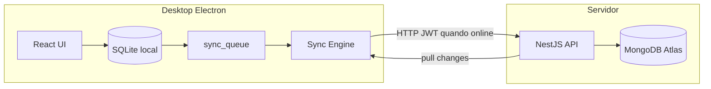

# Arquitetura FerroGestor

## Visão geral

FerroGestor é um sistema **offline-first** para gestão de ferro-velho (Bufalo Sucatas).

- O **desktop** (Electron) grava todas as operações no **SQLite local** primeiro.
- Uma **fila de sincronização** envia/recebe alterações via **API REST** quando houver internet.
- O **servidor** (NestJS) autentica localmente (SQLite) e sincroniza entidades no **MongoDB Atlas** quando online.
- O aplicativo **nunca** acessa Mongo/SQLite central diretamente — apenas a API.
- **Sem Docker** no fluxo normal. Sem internet o desktop segue com dados locais.

## Monorepo

| Pacote | Responsabilidade |
|--------|------------------|
| `apps/desktop` | UI, IPC, SQLite, sync engine, auto-update |
| `apps/server` | Auth, devices, sync push/pull, multi-tenant |
| `packages/shared` | Zod, enums, estratégias de conflito |
| `packages/database` | Schemas Prisma local + central, seeds |

## Princípios

1. Escrita local sempre primeiro.
2. Sync idempotente por `originOperationId`.
3. Monetário com `Decimal` (nunca float).
4. Datas em UTC no banco; fuso local na UI.
5. Soft delete (`deletedAt`).
6. Números de documento amigáveis por dispositivo/filial.
7. Auditoria em ações críticas.
8. Isolamento por `companyId` / `branchId`.

## Atualização automática

Tags Git `v*` disparam CI que publica instalador no GitHub Releases. O desktop usa `electron-updater`, faz backup do SQLite e aplica migrations locais.
