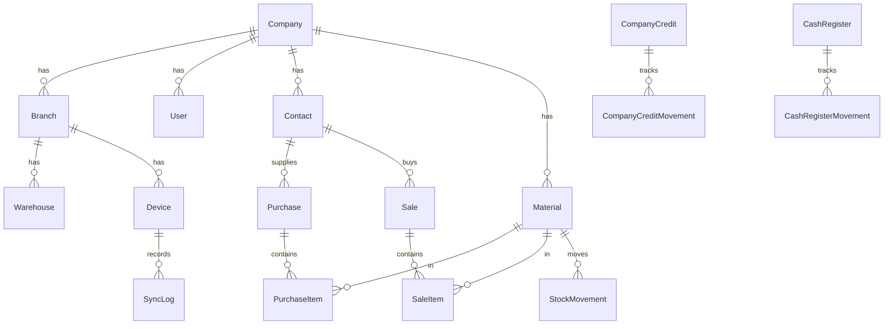

# Modelo de dados

Schemas Prisma:

- Central: `packages/database/prisma/central/schema.prisma` (PostgreSQL)
- Local: `packages/database/prisma/local/schema.prisma` (SQLite)

## Mixin sincronizável

Campos presentes nas entidades de negócio:

| Campo | Tipo | Uso |
|-------|------|-----|
| `id` | UUID | Identidade global |
| `localId` | Int? | Sequência local opcional |
| `companyId` | UUID | Multi-empresa |
| `branchId` | UUID? | Filial |
| `deviceId` | UUID? | Origem do registro |
| `createdAt` / `updatedAt` | DateTime UTC | Auditoria temporal |
| `createdByUserId` | UUID? | Responsável |
| `version` | Int | Controle de concorrência otimista |
| `syncStatus` | enum | Estado da sync |
| `syncedAt` | DateTime? | Última sync ok |
| `deletedAt` | DateTime? | Soft delete |
| `originOperationId` | UUID? unique | Idempotência |

## Diagrama ER (núcleo)

## Tabelas

`companies`, `branches`, `warehouses`, `devices`, `users`, `roles`, `permissions`, `contacts`, `contact_types`, `materials`, `material_categories`, `material_prices`, `company_price_tables`, `purchases`, `purchase_items`, `weighings`, `sales`, `sale_items`, `stock_movements`, `stock_processing`, `financial_accounts`, `financial_transactions`, `accounts_payable`, `accounts_receivable`, `company_credits`, `company_credit_movements`, `cash_registers`, `cash_register_movements`, `attachments`, `audit_logs`, `sync_queue`, `sync_logs`, `sync_conflicts`, `application_settings`, `sync_operation_receipts` (somente central), `refresh_tokens` (somente central).

## Estoque

Saldo **nunca** é campo editável único: deriva de `stock_movements` (entradas − saídas).
