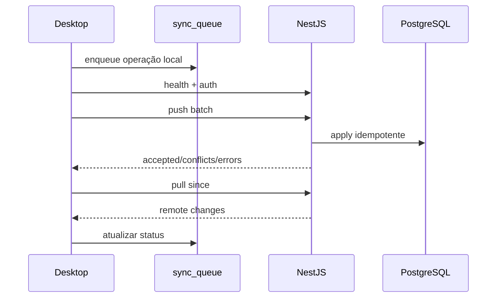

# Fluxo de sincronização

## Estados

`SYNCED` | `PENDING` | `SYNCING` | `CONFLICT` | `ERROR` | `CANCELLED`

## Ciclo no desktop

1. Verificar `GET /api/v1/health`
2. Autenticar dispositivo + usuário (`POST /api/v1/auth/login` ou `/devices/auth`)
3. Enviar lote `POST /api/v1/sync/push` (máx. 100 ops)
4. Receber `GET /api/v1/sync/pull?since=&deviceId=`
5. Aplicar no SQLite (respeitando `version`)
6. Registrar em `sync_logs`
7. Retry com backoff para `ERROR`
8. Exibir status na Central de Sincronização

## Idempotência

Cada operação carrega `originOperationId` (UUID). O servidor grava recibo em `sync_operation_receipts`. Reenvio da mesma operação **não duplica** compras, vendas ou pagamentos.

## Endpoints

| Método | Rota | Descrição |
|--------|------|-----------|
| GET | `/api/v1/health` | Disponibilidade |
| POST | `/api/v1/auth/login` | Login + tokens |
| POST | `/api/v1/auth/refresh` | Refresh token |
| POST | `/api/v1/devices/auth` | Auth com vínculo de dispositivo |
| POST | `/api/v1/sync/push` | Envio de operações |
| GET | `/api/v1/sync/pull` | Pull de alterações |
| GET | `/api/v1/sync/status` | Resumo pendências/conflitos |
| POST | `/api/v1/sync/conflicts/:id/resolve` | Resolução manual |

## Central de Sincronização (UI)

Mostra: conexão, última sync, pendentes, erros, conflitos, botão “Sincronizar agora”, histórico, detalhes de erro e exportação de diagnóstico.
